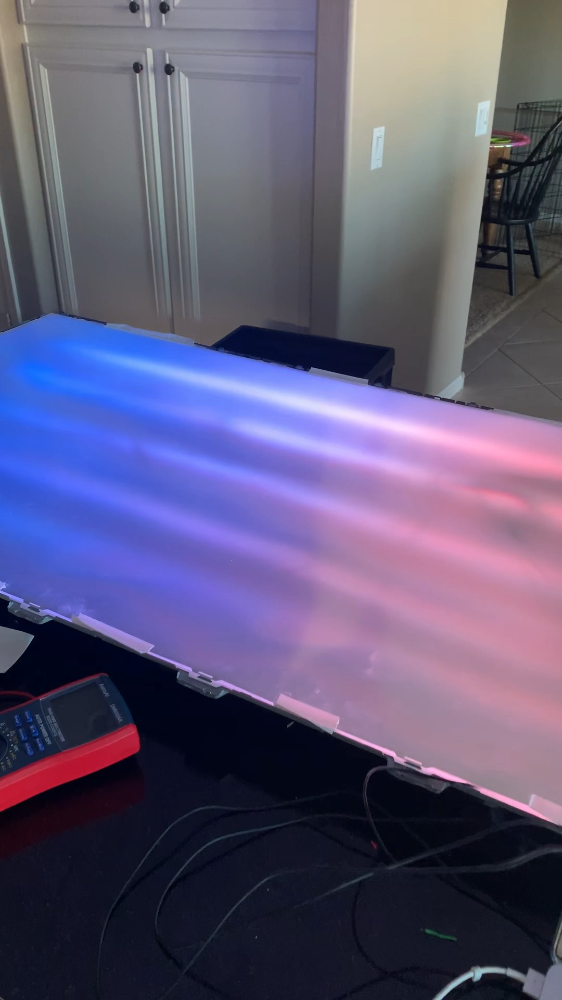
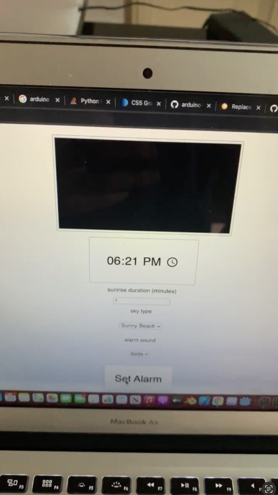

# AMUN Light Server

The AMUN Light was designed and created for my high school senior engineering capstone project.
> My Python skills have improved immensely since this project as I have been building and improving a complex Python webserver since 2021 for my startup [RECRUITid](https://www.recruitid.net) however, I have to keep that code private for security reasons. I hope to create an open source python project soon.

The device was a smart light solution that uses full spectrum light and fresnel optics to emulate sunlight coming from a windown or skylight in order to aid with gradually waking the user to overcome sleep inertia as well as to reduce the effects of SAD (Seasonal Affective Disorder)

The device consisted of a housing made from an old LCD TV which contained an RGB Led strip positioned behind a large fresnel lens to project the light as if it was cast from an infinite distance and reduce the inverse square law. The control system for the device consisted of a Raspberry PI connected to an arduino over a serial connection and a pair of speakers for alarm sounds. The Raspberry Pi ran the python webserver in this repository to allow users to wirelessly control the state of their lights and set alarms from any device on the same network.

One of the most challenging aspects of this project was communicating between the arduino and the Raspberry Pi. The alarm function included a simulated sunrise effect by applying an animated gradient to the LEDs so I had to devise a technique for sending the gradient data to the arduino in real time.

## Finshed Light Panel
this was taken during a sunrise sequence

## Simple web interface used to set alarms or set solid colors in real time

